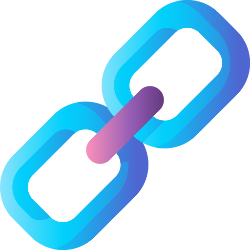
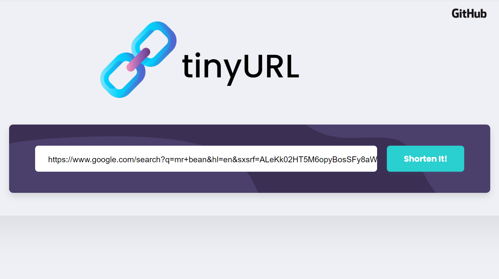
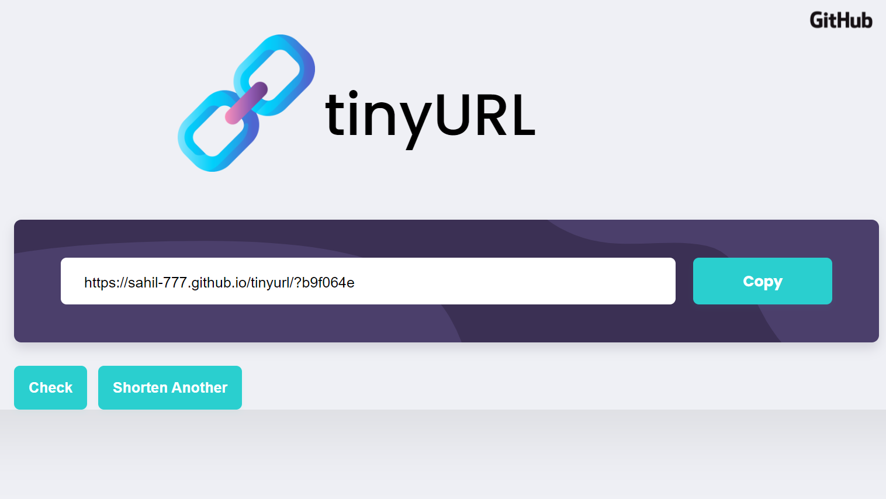
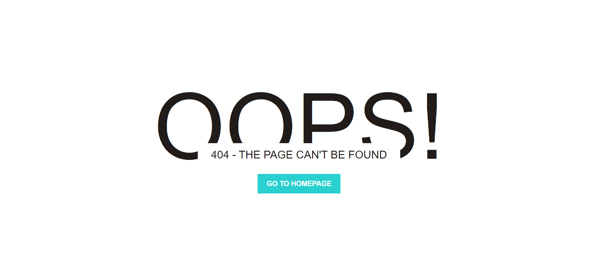

<h1 align="center"><b>Tiny URL</b></h1>

  A serverless web app to shorten the long URL
      

<!--

  # DEMO 
  - [Yet to be added](Link) - See Video

-->

## 🖥️ Live 
- https://sahil-777.github.io/tinyurl

 
## ⛏️ Built With 
- [AWS Lambda](https://aws.amazon.com/lambda/?nc2=h_ql_prod_fs_lbd) - Serverless computing platform
- [NodeJs](https://nodejs.org/en/) - Server Environment 
- [AWS DynamoDB](https://aws.amazon.com/dynamodb/?nc2=type_a) - NoSQL database 
- [BootStrap 4](https://getbootstrap.com/) - Frontend Library

<!--
## ER Diagram 

    System Architecture
    
   
-->

## 📸 Screenshots 

- Index Page

- Result Page

- Error Page

## 🔥 Installing
- [NodeJS](https://nodejs.org/en/) - Install NodeJS

      npm modules
          "md5": "^2.3.0",
          "dotenv": "^8.2.0",
          "nodemon": "^2.0.7"
 
<!--
## Project Structure 
    => yet to be added
      - yet to be added
    => yet to be added
-->
<!--
## Features:

    Registration and Login 
        • User will have to register themselves by providing basic information about them and then they can login into the system. 
        • Once users have logged in, users will be provided with Feeds Section. 

    Feeds section:   
        • All the posts will be viewed here.
        • Can also Like, Comment, Follow. 

    ❖ Profile Section:    
        • Basic information about the user like name,username & followers,following count. 

    ❖ Common Features 
    
        => Follow/Unfollow:
            User can follow or unfollow others user. If user is following a particular user, then that user can see their post on FEED (home-page) SECTION.

        => Search Bar: 
            User can find other people. 
-->
## ✔️ Functionalities
    ❖ Enter any LongURL to shorten it into shortURL
    ❖ Retrive original LongURL from shortURL by visiting it 

## ✍️ Author(s) 
- [@Sahil Velhal](https://sahil-777.github.io) 

## 🎉 Acknowledgments 
- [Tushar Roy System Design](https://www.youtube.com/watch?v=fMZMm_0ZhK4)
- [bitly.com](https://bitly.com)

 
 
